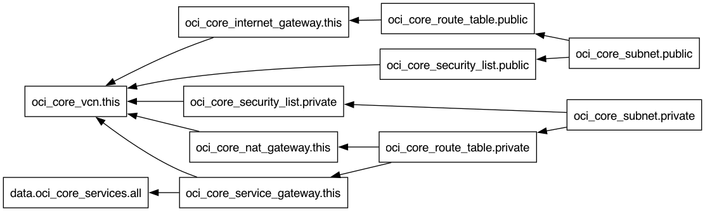

# vcn

## Requirements

No requirements.

## Providers

| Name | Version |
|------|---------|
|  [oci](#provider\_oci) | 7.27.0 |

## Modules

No modules.

## Resources

| Name | Type |
|------|------|
| [oci_core_internet_gateway.this](https://registry.terraform.io/providers/hashicorp/oci/latest/docs/resources/core_internet_gateway) | resource |
| [oci_core_nat_gateway.this](https://registry.terraform.io/providers/hashicorp/oci/latest/docs/resources/core_nat_gateway) | resource |
| [oci_core_route_table.private](https://registry.terraform.io/providers/hashicorp/oci/latest/docs/resources/core_route_table) | resource |
| [oci_core_route_table.public](https://registry.terraform.io/providers/hashicorp/oci/latest/docs/resources/core_route_table) | resource |
| [oci_core_security_list.private](https://registry.terraform.io/providers/hashicorp/oci/latest/docs/resources/core_security_list) | resource |
| [oci_core_security_list.public](https://registry.terraform.io/providers/hashicorp/oci/latest/docs/resources/core_security_list) | resource |
| [oci_core_service_gateway.this](https://registry.terraform.io/providers/hashicorp/oci/latest/docs/resources/core_service_gateway) | resource |
| [oci_core_subnet.private](https://registry.terraform.io/providers/hashicorp/oci/latest/docs/resources/core_subnet) | resource |
| [oci_core_subnet.public](https://registry.terraform.io/providers/hashicorp/oci/latest/docs/resources/core_subnet) | resource |
| [oci_core_vcn.this](https://registry.terraform.io/providers/hashicorp/oci/latest/docs/resources/core_vcn) | resource |
| [oci_core_services.all](https://registry.terraform.io/providers/hashicorp/oci/latest/docs/data-sources/core_services) | data source |

## Inputs

| Name | Description | Type | Default | Required |
|------|-------------|------|---------|:--------:|
|  [compartment\_id](#input\_compartment\_id) | OCI Compartment ID for the VCN. | `string` | n/a | yes |
|  [private\_subnet\_cidr](#input\_private\_subnet\_cidr) | IPv4 CIDR of the Private Subnet. | `string` | `"10.0.1.0/24"` | no |
|  [public\_subnet\_cidr](#input\_public\_subnet\_cidr) | IPv4 CIDR of the Public Subnet. | `string` | `"10.0.0.0/24"` | no |
|  [vcn\_cidr](#input\_vcn\_cidr) | IPv4 CIDR of the VCN. | `string` | `"10.0.0.0/16"` | no |
|  [vcn\_name](#input\_vcn\_name) | Name of the VCN. | `string` | n/a | yes |

## Outputs

| Name | Description |
|------|-------------|
|  [private\_subnet\_id](#output\_private\_subnet\_id) | OCID of the Public Subnet. |
|  [public\_subnet\_id](#output\_public\_subnet\_id) | OCID of the Public Subnet. |
|  [vcn\_id](#output\_vcn\_id) | OCID of the VCN. |

## Dependency Graph

