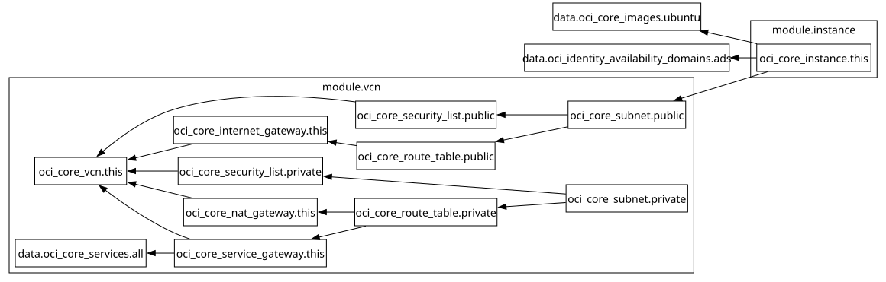

# dev - Terraform Docs

## Requirements

| Name | Version |
|------|---------|
|  [terraform](#requirement\_terraform) | >= 0.12.0 |
|  [oci](#requirement\_oci) | ~> 7.0 |

## Providers

| Name | Version |
|------|---------|
|  [oci](#provider\_oci) | 7.27.0 |

## Modules

| Name | Source | Version |
|------|--------|---------|
|  [instance](#module\_instance) | ../../modules/oci/instance | n/a |
|  [vcn](#module\_vcn) | ../../modules/oci/vcn | n/a |

## Resources

| Name | Type |
|------|------|
| [oci_core_images.ubuntu](https://registry.terraform.io/providers/oracle/oci/latest/docs/data-sources/core_images) | data source |
| [oci_identity_availability_domains.ads](https://registry.terraform.io/providers/oracle/oci/latest/docs/data-sources/identity_availability_domains) | data source |

## Inputs

No inputs.

## Outputs

| Name | Description |
|------|-------------|
|  [connection\_strings](#output\_connection\_strings) | Connection Strings for connecting to the instances. |
## Dependency Graph

