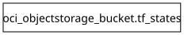

# global - Terraform Docs

## Requirements

| Name | Version |
|------|---------|
|  [terraform](#requirement\_terraform) | >= 0.12.0 |
|  [oci](#requirement\_oci) | ~> 7.0 |

## Providers

| Name | Version |
|------|---------|
|  [oci](#provider\_oci) | 7.27.0 |

## Modules

No modules.

## Resources

| Name | Type |
|------|------|
| [oci_objectstorage_bucket.tf_states](https://registry.terraform.io/providers/oracle/oci/latest/docs/resources/objectstorage_bucket) | resource |

## Inputs

No inputs.

## Outputs

No outputs.
## Dependency Graph

